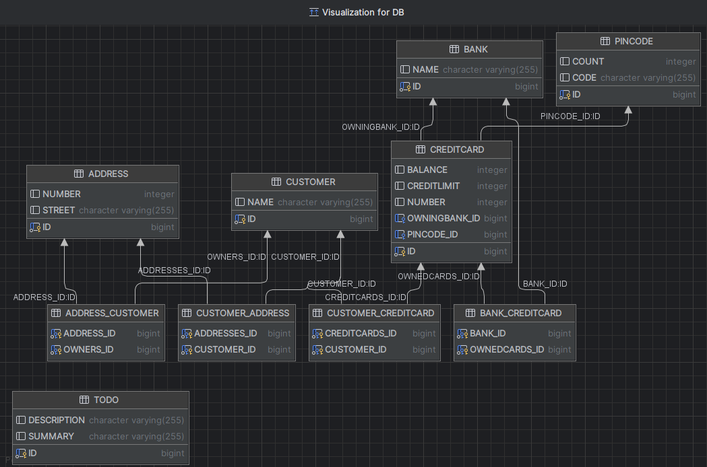

## Task questions:

1. Where is the database? Explain the used database and how/when it runs.
- The database engine being used is h2 and the database is stored on a file named DB.my.db. This is specified in the persistence.xml file by the hibernate.connection.url attribute.
  

- The file database content is being read on application startup and put into the Persistence context. 
- Finally, when the application finishes the h2 database is written to DB.my.db.


- The persistence unit uses hibernate as the JPA provider.
- Hibernate is handling the conversions between java objects and SQL queries.

2. Can you provide the SQl used to create the table Customer (Hint: Hibernate is used for the object-relational-mapping)?
- By enabling show_sql inside persistence.xml I could see the Hibernate SQL actions in the console:
```
create table Customer (
    id bigint generated by default as identity,
    name varchar(255),
    primary key (id)
)
```

3. Find a way to inspect the database tables being created and attach a screenshot of the database schema to your report.
   Do the created tables correspond to your initial thoughts regarding the exercise?
- I managed to inspect the database  in IntelliJ:
  
- There are the 6 tables specified by each of the JPA classes (including TODO).
  The last 4 tables (ADDRESS_CUSTOMER, CUSTOMER_ADDRESS, CUSTOMER_CREDITCARD, BANK_CREDITCARD) are created by hibernate for managing the relationship between the tables/classes.
  My initial thoughts where that there should be created 3 instead of 4 tables. I thought there would be a relationship table between: Address-Customer, Customer-CreditCard and CreditCard-Bank.


## Technical difficulties:

1. When I finished implementing the classes I still got a Junit test error:
   Test failed:
   Expected :is <[no.hvl.dat250.jpa.tutorial.creditcards.Customer@646d810b]>
   Actual   :   <[no.hvl.dat250.jpa.tutorial.creditcards.Customer@646d810b]>
- I fixed it by using Set<> instead of Collection<> inside the Customer and Bank class.


2. When trying to inspect the database in intelliJ I had another issue.
   IntelliJ only provides version 2.1.210 of the h2 driver, but I needed the 2.2.220 version for it to work.
   I changed the h2 driver manually to the 2.2.220 that was downloaded by Maven and then database inspection worked.